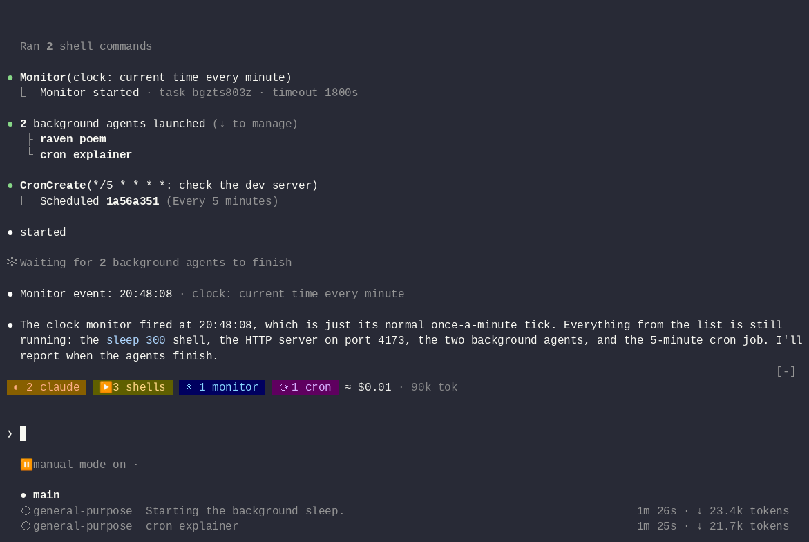

<picture>
  <source media="(prefers-color-scheme: dark)" srcset="docs/assets/banner-dark.svg">
  
</picture>

# rabe

**See what Claude Code runs in the background.**

Rabe (German for raven) is a Claude Code mod. It shows your subagents, Codex jobs, background shells, monitors, cron jobs and workflows in one place: a short band above the prompt, and a full view with `/rabe`.



Status: early development. Rabe tracks Claude subagents, workflows, Codex jobs started through the Codex plugin (`/codex:rescue`, `/codex:review`), background shells (with exit code and a guessed port), monitors (with each output line and when it arrived), cron jobs and `/loop` wakeups. `/rabe-stop codex:<job id>`, or `x: stop` in the pane, cancels a running Codex job. [What Rabe can see](docs/feasibility.md) lists where each piece of data comes from; [How Rabe is built](docs/architecture.md) describes the code.

## What you see

- **The band** above the prompt shows one row per kind while something runs: failures from the last 10 minutes first, then Claude agents, Codex jobs, workflows, shells with their ports, monitors, cron countdowns, and the token cost. It draws nothing when nothing runs, and one line when the rows do not fit.
- **`/rabe`** opens a pane with four tabs (`1` to `4`):
  - **Items**: every item grouped by kind, failures first, with a search field. A terminal pane of 90 columns or more shows the selected item beside the list; a narrower one shows it in one line under the list. Enter opens an item: the spend, brief and turns of a Claude agent; the spend, prompt and steps of a Codex job; the phases and agents of a workflow; the output and exit code of a shell; the received lines of a monitor; the next runs of a cron job.
  - **Cost**: tokens per agent and Codex job. Dollars show `n/a` until Rabe has a price table.
  - **Effects**: worktrees and open ports, with the `ssh -L` command to reach a port.
  - **Timeline**: when each item ran, and who started what.

In the terminal the band and the pane are drawn as colored cells; the desktop app shows the same content as text and buttons.

Keys: `j` and `k` move, Enter opens, `b` goes back. Letters act on the selected item: `s` search, `x` stop, `g` stop group or run, `m` message an agent, `c` copy, `d` delete a cron job. The buttons under the pane show each key. A letter that is not bound goes to the prompt. Esc closes the pane.

Rabe hides Claude Code's own count of background work (`2 shells, 1 monitor · ↓ to manage` under the prompt, and `still running` at the end of a turn), since the band shows it. Turn this off with the plugin option `hideBuiltinTasks` in `/plugin`. The agent list under the prompt cannot be hidden.

## Install

Type this at a Claude Code prompt:

```
/plugin install rabe --marketplace lorenzh/rabe
```

## Develop

Install the development tools with [Bun](https://bun.sh) 1.4, then run Claude Code with the mod loaded from this folder. It reloads when you save a file.

```sh
bun install
claude --plugin-dir .
```

Run all checks (lint, type check, manifest validation and tests), as CI does:

```sh
bun run check
```

Contributor and agent rules are in [AGENTS.md](AGENTS.md).

## License

[MIT](LICENSE)
